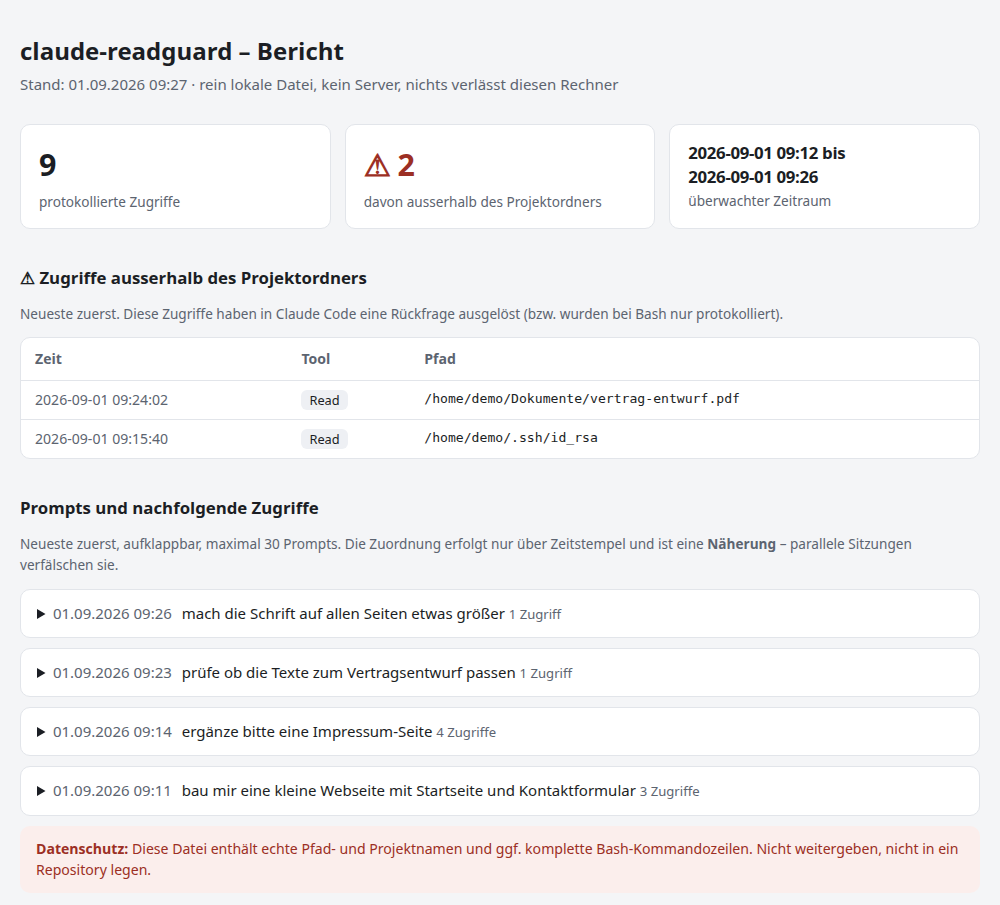

# claude-readguard

Ein kleiner PreToolUse-Hook für Claude Code, der sichtbar macht, welche Dateien
Claude Code liest – und der **nachfragt**, bevor auf etwas ausserhalb des
Projektordners zugegriffen wird.

Gedacht für alle, die nicht den Code prüfen wollen, sondern das Verhalten:
Was liest Claude Code von sich aus, ohne dass ich es ausdrücklich angewiesen
habe?



*Der HTML-Bericht (`readguard-html`) – Screenshot mit Demo-Daten.*

## Funktionsweise

Der Hook (`~/.claude-readguard/readguard.sh`) wird vor jedem Aufruf der Tools
`Read`, `Glob`, `Grep`, `Bash` und `NotebookRead` ausgeführt und

- protokolliert jeden Zugriff als `ZEIT [TOOL] PFAD` in
  `~/.claude-readguard/reads.log`,
- lässt Zugriffe **innerhalb** des Projektordners und relative Pfade still
  durch,
- filtert Claude-Code-eigenes Rauschen komplett heraus (`.claude/`,
  `.claude.json`, `.npm/`, `.cache/claude`, `node_modules/`,
  `.config/claude`) – das liest Claude Code bei jedem Start selbst,
- lässt Pfade durch, die in `~/.claude-readguard/allowlist` stehen
  (ein Muster pro Zeile, `#` = Kommentar, Wildcards erlaubt),
- markiert alles andere zusätzlich als `[AUSSERHALB]` im Log und löst in
  Claude Code eine **Rückfrage** aus, bevor der Zugriff stattfindet,
- protokolliert bei `Bash` nur den Kommandotext, blockiert aber nicht
  (siehe unten).

## Installation

```
bash install.sh
```

Das Skript kopiert den Hook nach `~/.claude-readguard/`, legt eine
kommentierte Beispiel-`allowlist` an und registriert den Hook in
`~/.claude/settings.json`. Von der settings.json wird vorher ein Backup
angelegt (`settings.json.bak.DATUM`). Benötigt wird `jq`
(`sudo apt install jq`).

Bereits laufende Claude-Code-Sitzungen müssen neu gestartet werden, damit der
Hook greift.

## Auswertung

Zwei Wege, gleicher Inhalt:

```
readguard-report        # Textbericht im Terminal
readguard-html          # HTML-Bericht im Browser (rein lokal, kein Server)
```

Der HTML-Bericht wird nach `~/.claude-readguard/report.html` geschrieben und
über `file://` im Standardbrowser geöffnet – es läuft kein Server, nichts
verlässt den Rechner. Zusätzlich legt `install.sh` einen Startmenü-Eintrag
**„Readguard Bericht"** an, der den Bericht per Klick neu erzeugt und öffnet.

Beide Berichte zeigen zuerst alle `[AUSSERHALB]`-Treffer, danach eine
Ordner-Übersicht (wo wurde wie oft gelesen), die zuletzt ausgeführten
Bash-Befehle und die vollständige Zugriffsliste. **Bewusst ohne
Chat-Inhalte:** Die eigenen Prompts erscheinen nirgends im Bericht – der
Fokus liegt auf den Dateizugriffen.
**Achtung:** Diese Zuordnung erfolgt nur über Zeitstempel und ist eine
Näherung – bei parallelen Sitzungen stimmt sie nicht zuverlässig. Passt das
History-Format nicht, fällt das Skript auf die reine Zugriffsliste zurück.

## Lückenlose Aufzeichnung: `claude-audit`

Der Hook hat prinzipbedingt eine Lücke: Bei Bash-Befehlen sieht er nur den
Kommandotext, nicht die Dateien, die der Befehl wirklich öffnet. Wer es
lückenlos will, startet Claude Code so:

```
claude-audit
```

Das startet Claude Code unter `strace` – das Betriebssystem zeichnet dann
**jede** Dateiöffnung von Claude Code und allen Unterprozessen auf, auch
innerhalb von Bash-Befehlen. Nach dem Beenden der Sitzung erscheint
automatisch die Auswertung: alle geöffneten Dateien, sortiert nach innerhalb
und ausserhalb des Projektordners, System-Rauschen herausgefiltert. Später
erneut anzeigen: `readguard-audit`. Benötigt `strace`
(`sudo apt install strace`); die Sitzung läuft dadurch etwas langsamer.

Diese Liste kommt vom Betriebssystem, nicht von Claude selbst – sie ist
unabhängig von jeder Selbstauskunft.

## Was es nicht leistet

Ehrlichkeit vor Marketing – dieses Tool hat klare Grenzen:

- **Geöffnet ist nicht übertragen.** Das Log zeigt, welche Dateien geöffnet
  wurden, nicht, welche Inhalte tatsächlich an die Anthropic-Server gesendet
  wurden.
- **Der Hook allein hat eine Bash-Lücke.** Bei `Bash` steht im Hook nur der
  Kommandotext, nicht die Dateien, die der Befehl dann wirklich liest. Ein
  `cat ~/.ssh/id_rsa` innerhalb eines Bash-Befehls wird protokolliert, aber
  nicht blockiert. Diese Lücke schliesst erst `claude-audit` (siehe oben) –
  allerdings nur aufzeichnend, nicht blockierend.
- **Keine Sandbox.** Ein Hook ist eine Konvention, keine Durchsetzung. Echte
  Grenzen liegen auf Betriebssystemebene (eigene Benutzerkonten, Container,
  Dateirechte, AppArmor/SELinux).
- **Die Serverseite bleibt unberührt.** Was mit übertragenen Daten bei
  Anthropic passiert, kann ein lokales Tool weder sehen noch beeinflussen.

## Datenschutz-Warnung

`reads.log` enthält **echte Pfad- und Projektnamen** von diesem Rechner und
unter Umständen komplette Bash-Kommandozeilen. Diese Datei gehört **nicht in
ein Repository** und nicht in geteilte Ordner. Die mitgelieferte `.gitignore`
schliesst `reads.log`, `allowlist` und Backups aus.

## Lizenz

MIT – siehe [LICENSE](LICENSE).
